This last weekend I finally got around to writing up my trip report for [my hike along the West Highland Way](/hiking/walking-the-west-highland-way-in-scotland/) in 2018. Now that that's out of the way, I'm thankful I can finally get around to posting my thoughts on the Great Glen Way.

The Great Glen Way for all intents and purposes can almost be looked at as the second half of the West Highland Way (WHW). While the WHW finishes in Fort William, the Great Glen Way literally starts where it leaves off. After I finished the WHW, my friend Tony and I took the train to Edinburgh to relax for a few days. Heading back to the Great Glen Way was essentially that train ride in reverse, partially along the same route as the WHW, so in many ways it felt a lot like coming back home.

Now first up, let's talk about COVID-19. I was in Spain during the first global wave of COVID-19, and we were essentially housebound for more than 90 days. That meant no exercise, no long walks in the park, no visiting friends - simply three months watching Netflix, doing web development, and occasionally heading out to pick up some groceries. So when things improved in July and Europe opened up the travel corridors again, I literally jumped at the chance to head into the wilderness for some hiking.

I had a few friends who weren't afraid to private message me to let me know that they thought it was a selfish decision. But I feel reactions like that are more based on emotion than on data. The odds of catching COVID-19 on a partially empty airplane don't seem particularly better or worse to me than catching COVID-19 in a crowded supermarket or waiting in line at the pharmacy. That said, I wanted to do my responsible part, so I paid for both a PCR and an antibody test before getting on the plane to make sure I wasn't taking it with me at least.

#### Fort William

I flew from London, England to Glasgow, Scotland, and took the train immediately to Fort William. I forgot what a beautiful train ride that is up to Fort William.

Stepping off the train felt so great to be back, even though the weather wasn't looking very appealing. I have been sort of blessed in that all of my hikes in the last five years have had unseasonably warm weather. On the Camino de Santiago, for example, I spent 33 days on the trail (28 days walking) and only had about four hours of rain spread out over three days. And that was in April and May, which are notoriously rainy months along the trail.

The West Highland Way? Basically seven days of beautiful sunshine.

So when I pulled up the weather forecast in Fort William and saw a ton of rain on the horizon, I sort of just looked at it like karma finally getting around to paying me back. And boy did it ever pay me back that first day.

#### The Walk

I'm not going to go through and detail all the various stages, because in all honesty many of them are fairly similar. In general though a lot of the Great Glen Way (GGW) follows the [Caledonian Canel](Caledonian_Canal). That's both a blessing and a curse - it's nice to always have a route to follow, especially one that follows a river, but the scenery on many days doesn't change all that much.

\[caption id="attachment\_14167" align="aligncenter" width="720"\]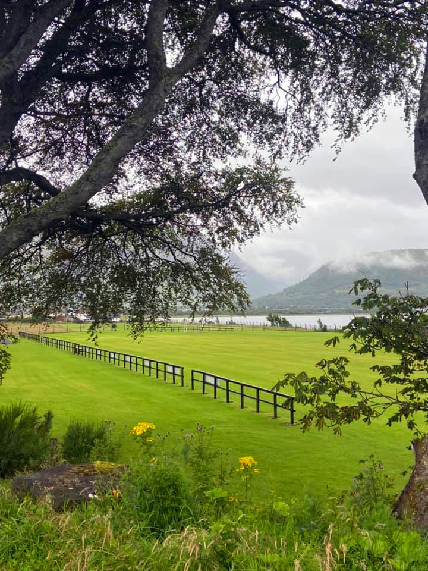 Approaching The Caledonian Canal\[/caption\]

The first stage is normally from Fort William to Gairlochy, which isn't that far. Unfortunately for me a light drizzle in the morning quick turned into a full on downpour lasting the entire day.

\[caption id="attachment\_14170" align="aligncenter" width="960"\]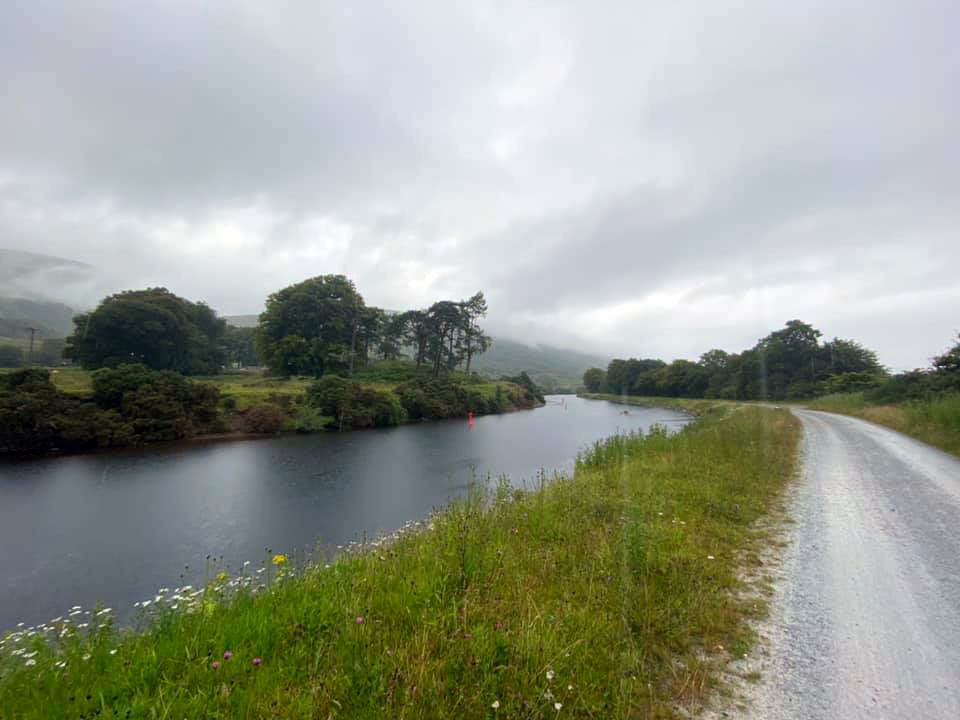 Many Days Were Spent Wakling Along The Canal\[/caption\]

In normal, non-COVID19 times, a bus would be waiting in Gairlochy to take me to my accommodation, about 5km away from the trail. But due to the pandemic the buses weren't running. Normally I probably would have just walked it, but by the time I reach the turn-off to Gairlochy I was absolutely drenched to the bone. Literally everything I had was dripping wet, and even my waterproof iPhone had given up.

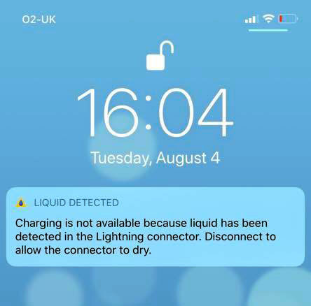

I found a phone booth at roughly the spot the bus would normally pick us up, and inside the phone booth I found a business card for a cab company. Given that I couldn't feel any part of my body anymore, I decided to simply call a cab to take me the 5km so I could dry off. Unfortunately for me when I arrived the BnB was completely closed, and wouldn't be open for another two hours. I went looking for food, but nothing was open due to COVID-19. Eventually I found a single cafe that was open, and they were nice enough to let me inside even though I was making a puddle simply by standing around. I treated myself to a burger, but was mostly watching the clock for when I could check into my BnB and change my clothes.

Once I made it into the BnB I quickly stripped my clothes (more like peeled them off slowly, since they were stuck to my body), and took one of the longest showers of my life to warm up. When I finally got dressed, I found a nice gas fireplace in the living room to relax next to.

\[caption id="attachment\_14175" align="aligncenter" width="960"\]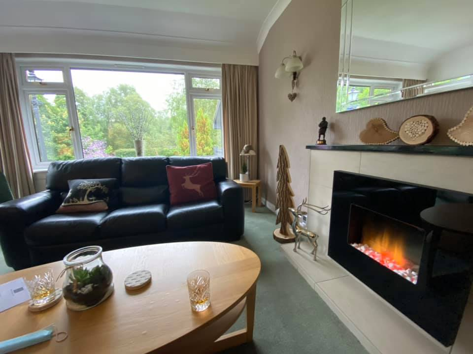 My Own Personal Fire\[/caption\]

And even better, the owner brought me a menu of his house scotches, which I proceeded to down in quick succession. The owner was quite keen to talk to me since I guess when he was younger he was in the Scottish Army and had been stationed in Canada - so he was happy to be talking to a Canadian and re-living some old memories from his youth.

After the scotch kicked in and I ate the take-away pizza from the cafe, I crawled into bed hoping that the weather would be better the next day.

#### Next Few Days

The next few days were mostly along the canal, which was easy walking but also a tad boring after a while. Thankfully the weather improved every hour or two, and by the time I reached Fort Augustus at the end of day three I was blessed with some blue sky and sunshine.

\[caption id="attachment\_14174" align="aligncenter" width="720"\]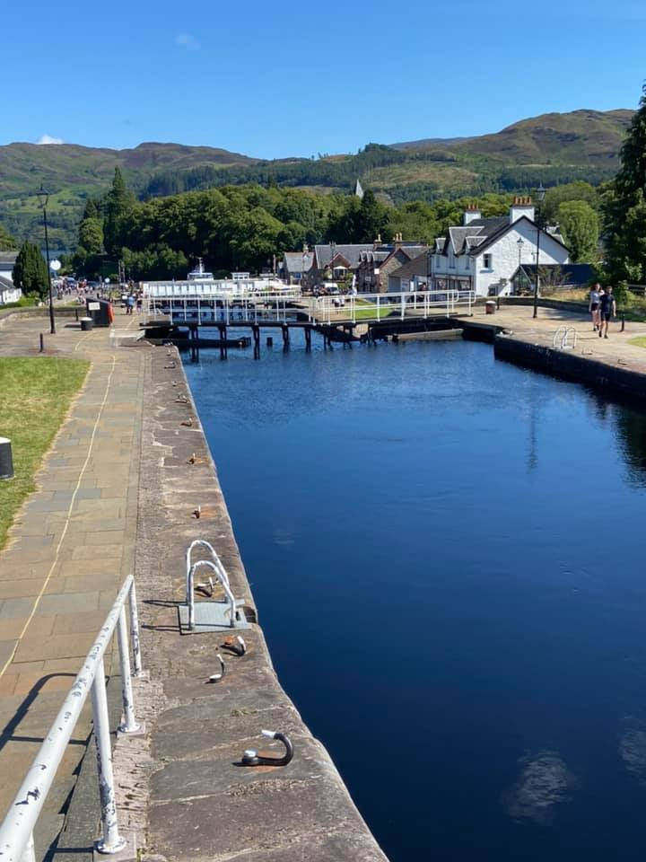 Arriving in Fort Augustus\[/caption\]

I was super excited to see that there were a few pubs open, so I ordered a beer, whipped my shoes and socks off, and had a few leisurely beers in the sun beside the canal.

\[caption id="attachment\_14188" align="aligncenter" width="720"\]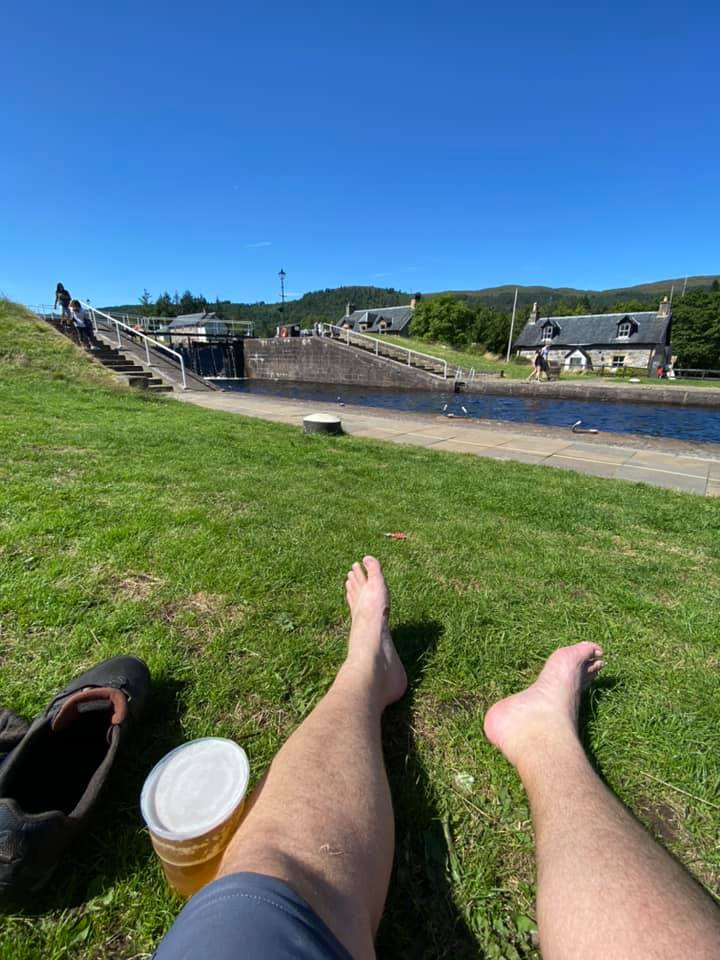 Fort Augustus Beers Are The Best Beers\[/caption\]

#### Taking The High Road

When leaving Fort Augustus I knew I would be presented with an option to take a high road above Loch Ness, or a forest trail along it. To be perfectly honest, without other people pushing me on the trail, I'm not always the person who goes for the immediate challenge when it comes to harder paths to follow. I hadn't made a decision about which one I was going to walk when I set out in the morning, and figured by the time I reached the fork a decision would present itself.

As I got closer to the fork, I noticed the weather was clearing, which was great. I figured if it was cloudy or foggy there wasn't really much point taking the high road since I wouldn't be able to see anything anyways. And right before I hit the fork I ran into a lady walking her dog. I'm always a bit cautious about approaching lone females in the wilderness, just in case they get a bit freaked out with a guy approaching them. But her and her dog came right up to me for a nice chat, and like most people I met in Scotland, were super keen to talk with a visitor. She assured me the high road wasn't too bad, which cemented my decision to start climbing.

\[caption id="attachment\_14179" align="aligncenter" width="1024"\]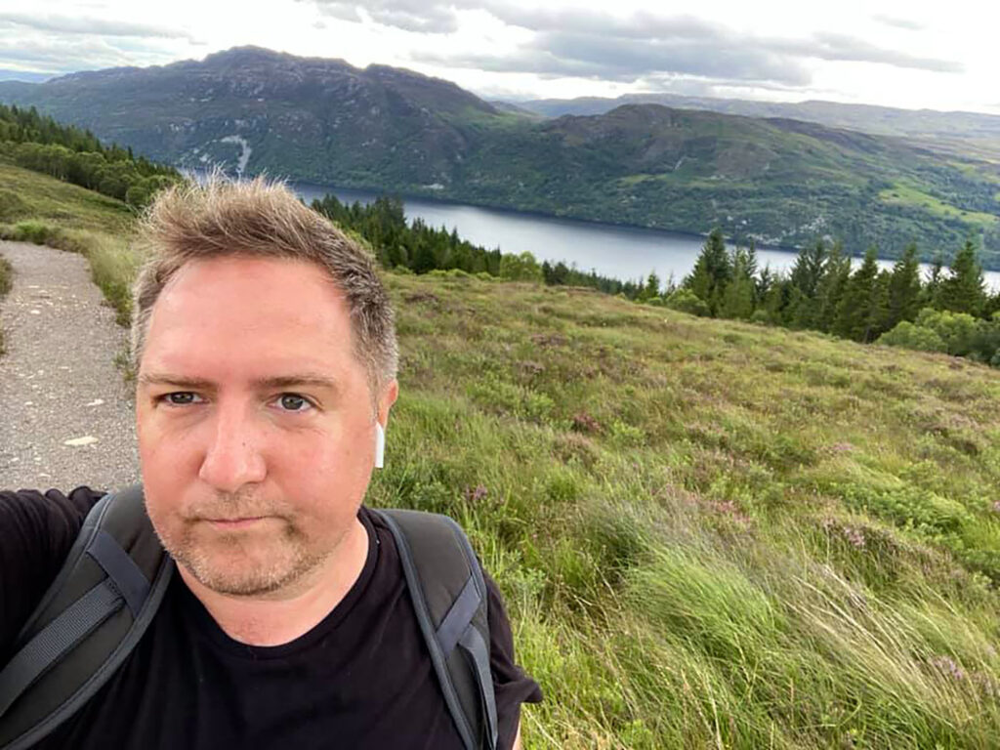 Me, On The High Trail Above Loch Ness\[/caption\]

Growing up in Canada I had heard stories about Loch Ness and the fabled Loch Ness monster, so it was great to to finally see it with my own eyes. My province in Canada, British Columbia, has its own monster which always reminded me of stories of the Loch Ness one - [The Ogopogo](https://en.wikipedia.org/wiki/Ogopogo).

The next few hours were absolutely glorious walking. The sun was shining, the wind was blowing, and I remember feeling amazingly alive as I walked up and down the rolling hills above Loch Ness.

\[caption id="attachment\_14183" align="aligncenter" width="960"\]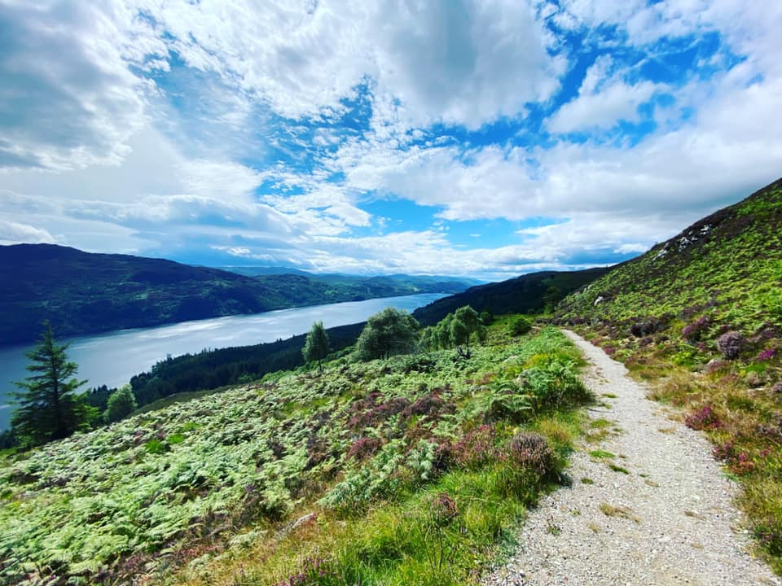 The Upper Trail Above Loch Ness\[/caption\]

The next stage, from Invermoriston to Drumnadrochit, also had a high route, and I decided to take that as well. Even though my guidebook said this was a 6 hour, 23.5km walk, I somehow managed to do it in about 4.5 hours. I normally like to take breaks every hour or so, but it was such a nice day and the weather was so nice that I just couldn't bring myself to stop. That meant I got into the next town super early, which of course meant beer o'clock. As it turned out I was the only person staying at the BnB, so they basically gave me a key to the place and said go nuts.

\[caption id="attachment\_14186" align="aligncenter" width="754"\]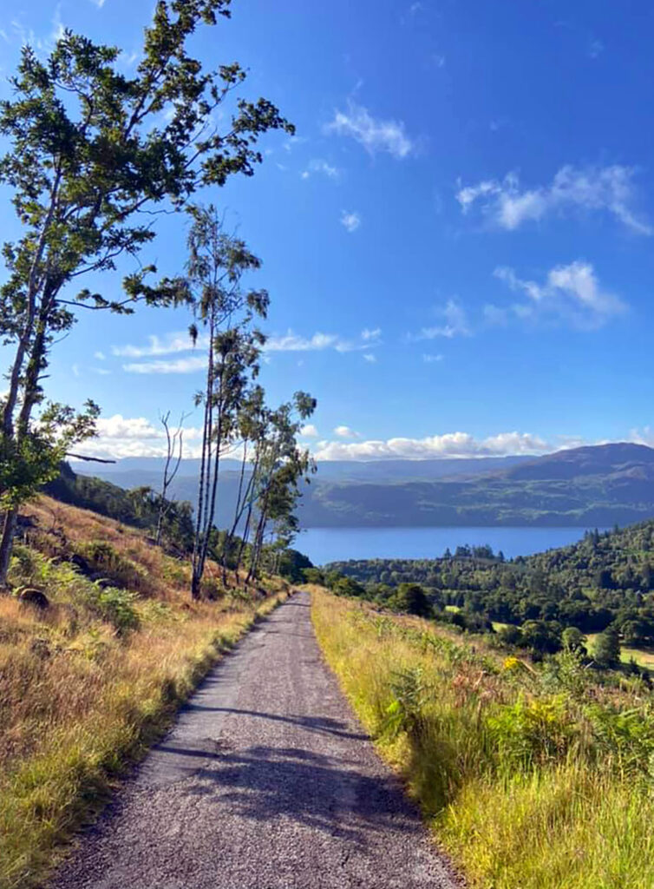 Heading To Drumnadrochit\[/caption\]

I walked down to the grocery store, picked up some snacks and beers (enough for tomorrow too), and spent the afternoon in the sun by the BnB just relaxing. It was glorious.

Of course what wasn't so glorious is that when I left the next day I accidentally forgot to bring that bag of snacks. Oh well.

One thing to mention at this point was that various parts of the trail were unkempt, especially towards the end. I blamed a lot of it on COVID-19 - why would people be maintaining the trail if nobody was walking it? But I suspect it ran a bit deeper. I encountered lots of missing markers along the trail, enough that it started to seem suspicious. So either the odd hiker was stealing a marker as a trophy (bad, bad hiker), or maybe locals were moving them. Regardless I found myself lost a few times because I couldn't find a marker. This next one, for example, took me 30 minutes to find.

\[caption id="attachment\_14190" align="aligncenter" width="715"\] Found Marker\[/caption\]

I was lucky in that I noticed it out of the corner of my eye way up on the hill beside me. When I backtracked and found the junction I needed to take, the marker for the GGW was noticeably missing, even though I could see where it was once attached.

\[caption id="attachment\_14192" align="aligncenter" width="768"\]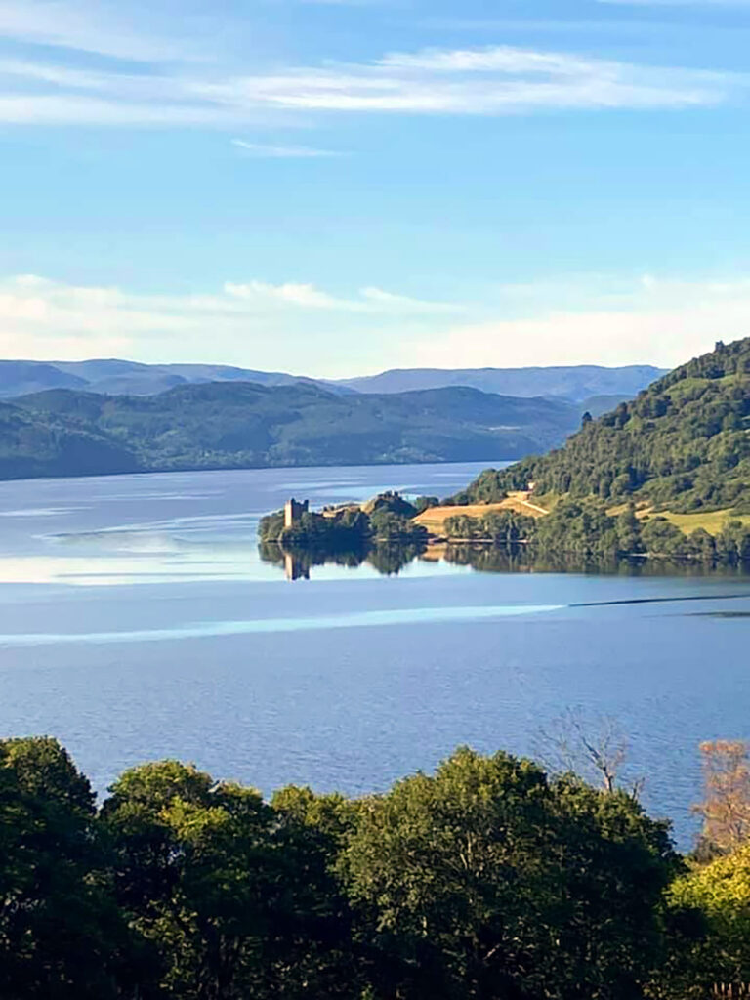 Walking By A Castle\[/caption\]

The final day into Inverness was fairly long (over 30kms), but mostly along forest trails with the occasional view of the loch. I was lucky in that the trail actually passed right by my BnB in Inverness, which meant I could change and shower before trying to find the end marker.

Surprisingly I couldn't really find any good information on where the trail ended. I assumed it would be near the castle, but with COVID-19 and some renovations in the area, I wasn't sure where to find it.

\[caption id="attachment\_14194" align="aligncenter" width="720"\]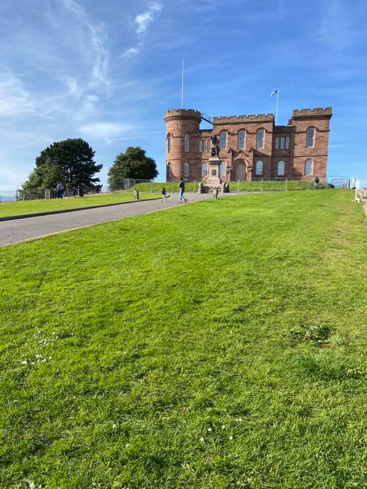 Inverness Castle\[/caption\]

Not far from the castle I eventually found the end marker for the Great Glen Way, and snapped this quick selfie.

\[caption id="attachment\_14195" align="aligncenter" width="960"\]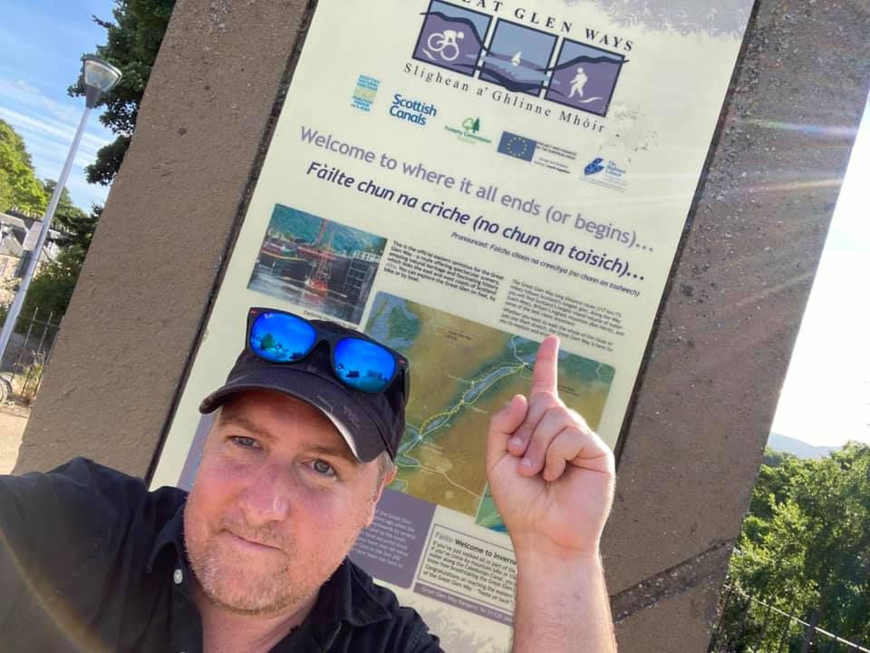 Me, Another Long Distance Hike In The Bag\[/caption\]

#### Final Thoughts

Prior to walking the GGW I reached out to my friend Blair, who had walked both the GGW and the WHW, and asked him what he thought of the GGW. He said he found it disappointing compared to the WHW, which I can somewhat relate to. I try not to compare hikes against each other since it's really difficult to do - lots of things influence our enjoyment of hikes such as the weather on a certain day, or even our moods. I found lots of reviews on the internet from people who actually preferred the Great Glen Way over the West Highland Way, so personal preference towards the type of walking certainly matters. All that being said, I definitely preferred the West Highland Way myself. The scenery on the WHW is a lot more varied compared to the GGW, especially with about half of the GGW being along the Caledonian Canal. I think if you're the type of person that just prefers a nice easy walk in the outdoors, then the GGW is a pretty nice hike. But if you prefer more varied scenery and a harder physical challenge, then I think the WHW probably wins.

Walking the GGW in the summer of the COVID-19 pandemic was a big eye-opener. Deaths by COVID-19 are of course incredibly tragic. But I met so businesses on the trail who were hesitantly opening up again because, quite frankly, they desperately needed the money. While the BnB owners were of course super cautious with everything, it was heartbreaking to hear some of their stories regarding potentially losing their business or having to let employees go. So while it's easy to focus on statistics like number of infected and number of deaths, let's not forgot the countless people who have lost their businesses, their livelihoods, and in many ways their futures, because of COVID-19 as well. Certainly the people who opened their homes to me were thankful I was choosing to walk and help them dig their way out of the COVID-19 hole, and I was thankful for their presence as well.

I think I speak for every nature lover out there when I say I'm looking forward to the day COVID-19 is completely controlled and we can start to get outside and walk again. Since I returned from the Great Glen Way, things have deteriorated again in Spain, and we're mostly on a de-facto lockdown. But if things let up again in the summer, I may try to walk a portion of a local Camino if possible. But regardless, you'll find me outside again soon enough I hope.
