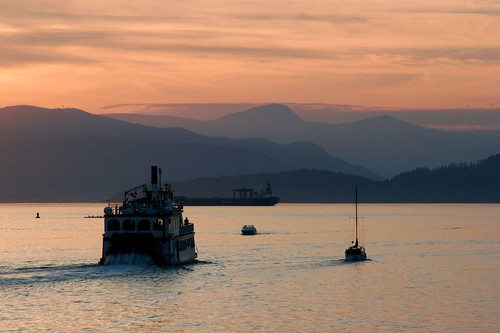

I really wish I had some really great things to write about. But the truth is, I didn't really get up to much this weekend. I've been working on a pretty cool project at work, so I spent most of Friday night trying to lay the groundwork for it (yeah I know, real cool way to spend a Friday night, but oh well). Saturday night we went down the Global/Afterglow for Kate's sister's birthday party. That was a pretty fun time, even though the drinks were ridiculously overpriced (Derek's martini was $15). I'm not really sure why, but I've been a bit bummed out lately. I've been trying to get some sunlight and just do more things, but so far no go. Thankfully I have a week off coming up at the end of June to relax and unwind. I debated going to Ottawa for Canada day, but the flights are just too much money right now. I think the current plan is to spend a week camping around Banff/Lake Louise, and maybe visit some friends in Calgary for a day or two.

Tomorrow night I'm meeting with my supervisor out at UBC to finalize when my thesis defense will be. It should be sometime late June or early July. I'll be really glad when that's done, since it's been hanging over my head for nearly four years now. I can't even imagine what a load off it's going to be when I finally defend and hand this piece of garbage in. It's been so hard working on my thesis in the evenings since I always have way more interesting stuff going on at work.

Oh well. I don't have many plans for this week. I'd like to check out that Al Gore movie, "An Inconvienient Truth." I'll probably catch that Wed or Thurs down at Tinseltown. If anyone wants to tag along, let me know.

