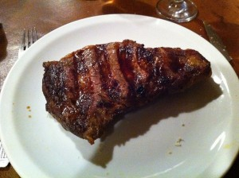

So last night I was really craving a kick ass steak dinner. I generally eat pretty healthy during the week, which means I look forward to indulging a bit more on the weekends. I did a quick Google search and ended up deciding that I wanted to visit [La Cabrera](http://www.parrillalacabrera.com.ar/), which is a very well known steak house and also the [#3 restaurant](http://www.tripadvisor.com/Restaurant_Review-g312741-d794286-Reviews-La_Cabrera-Buenos_Aires_Capital_Federal_District.html) (out of about 770 or so) in all of Buenos Aires on TripAdvisor. So I was definitely looking forward to it.

Jump ahead about 15 minutes and I found myself outside of the restaurant, just south of Plaza Serrano. It looks like a nice enough place, and there are a few people standing outside having a smoke. There's a patio with about 10 tables, and they are all empty. Looking inside I notice that there are about 3 or 4 tables with people at them, and another 10 or so that are completely empty. So I walk up to the lady at the door and ask for a table for one. She politely smiles and then tells me that there's at least a 30 minute waiting list to get it. I do a double take again at all the empty tables, and then look back at here. "Really?" I say? She says "really."

I'm not sure if that's the same strategy Vancouver bars use, that is having a big line up outside to make the restaurant look more busy, but I wasn't about to wait 30 minutes to get into a restaurant that was apparently empty.

So I walked about a block away to a little Mexican place that I had gone to before, [La Fabrica Del Taco](http://wander-argentina.com/la-fabrica-del-taco-–-mexican-street-food-fun-in-palermo/), and ate a few tasty tacos.

I have to admit, I was rather disappointed I didn't get to have steak, and I don't entirely understand what happened. It's my first experience with being denied immediate entrance into any place in Buenos Aires, and it's made completely weird by the fact the restaurant was almost entirely empty. So, not sure if I'll make another attempt or not.
