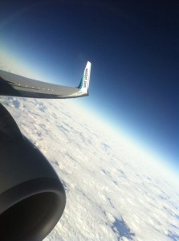

We have limited flight options here in Canada, one of which is [WestJet](http://www.westjet.com). Compared to some of their competitors, WestJet comes across as fun, receptive, and youthful, which is why I do my best to fly WestJet whenever I can.

Every Wednesday, WestJet asks people via their Twitter stream ([@westjet](http://twitter.com/westjet)) to submit photos of the winglets on their planes. For those of you who don't know, a winglet is the little tip that points up on the edge of the wings. Winglets technically increase drag on the airplane, but decrease the turbulence from wingtip vortices. In most cases winglets improve the airplane's efficiency, causing it to use less fuel for the same flight. So not only does WestJet benefit financially from their use, but it also lowers the impact of the airplanes on the environment.

I've taken quite a few photos of WestJet winglets over the years, but I've attached a recent one to this post. The shot was taken at 36,000 feet on my way to Cancun, Mexico (where I am currently close to).
