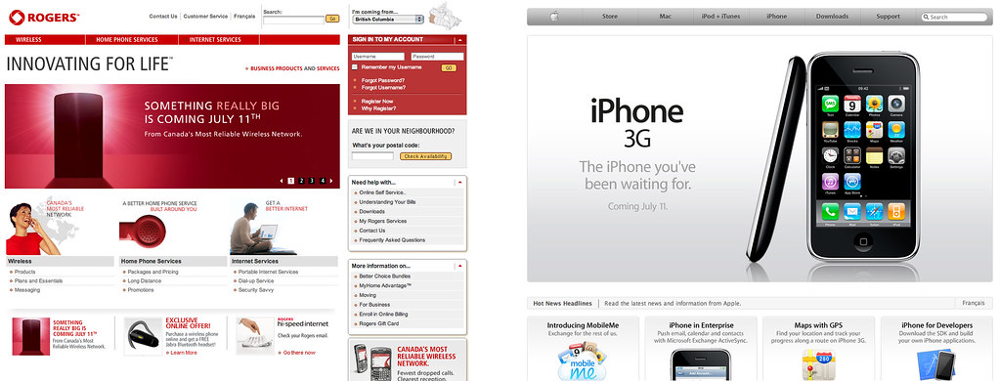

[Dave](http://www.mezzoblue.com) summed up the sentiment behind this post with one of his recent Flickr photos:

While most of Canada is ecstatic for the release of the iPhone in Canada, one company seems rather mute about the whole event. Ironically, that company is [Rogers](http://www.rogers.com), the only company that has the technology to actually bring the iPhone to Canada. As Dave pointed out, the Apple website has been updated to reflect all the available information regarding the iPhone in Canada. Roger's unfortunate marketing campaign involves what exactly? A simple teaser, like we've all been living in a cave and have absolutely no idea what's coming out next month.

As I've mentioned before, I'm fairly certain Roger's data plan will be overpriced, which is why I suspect they are holding out as long as possible before revealing it to Canadians.
