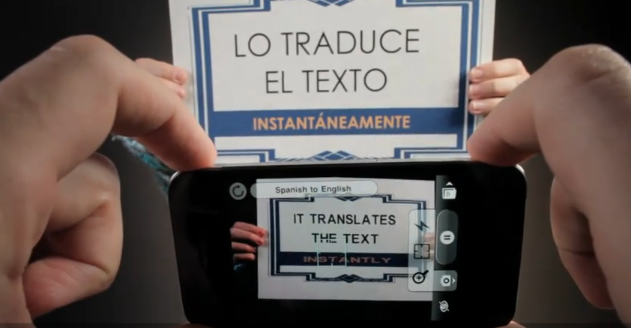

My friend John sent me this link. I think you have to watch the video to truly appreciate the application:

Basically it's an iPhone application that can translate (in real time) between Spanish and English. Obviously the grammar is a tad off since the words don't get reordered, but I can imagine a lot of really great uses for this on my trip. I'm going to grab a copy and play around with it this weekend. But definitely cool.
